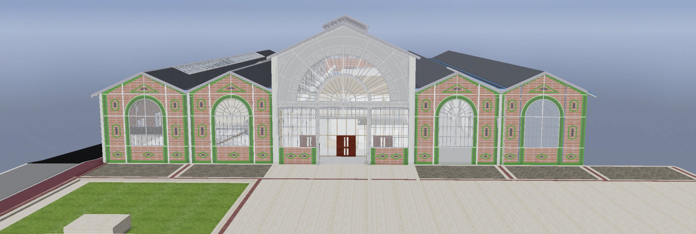

# GroupB

---

Table of Contents

  
- [GroupB](#groupb)
  - [1.Project scope](#1project-scope)
    - [a. Goals](#a-goals)
    - [b. Deadlines](#b-deadlines)
  - [2. Risk and assumptions](#2-risk-and-assumptions)
    - [a. General](#a-general)
    - [b. Motion sickness](#b-motion-sickness)
  - [3. Glossary](#3-glossary)
  - [4. Product overview](#4-product-overview)
  - [5. Personae](#5-personae)
  - [6. Uses cases](#6-uses-cases)
  - [7. Requirements](#7-requirements)
    - [a. Populated school](#a-populated-school)
    - [b. Environment interaction](#b-environment-interaction)
    - [c. Door security](#c-door-security)
    - [d. School architecture](#d-school-architecture)
  - [8. Non-functional requirements](#8-non-functional-requirements)
  - [9. Configuration](#9-configuration)

---
## 1.Project scope

### a. Goals

The main goal of this project is to create a virtual reality (VR) simulation to visualize our future school in the B3 of Vierzon. Furthermore this simulation is here to detect futures problems that could happen in the school. As a reminder the B3 is a historical monument base in the centre of Vierzon. We also have to realize all the interactions with the doors, the faucet in order to create a functional school. It will be possible to visit the school through virtual reality with the Oculus Quest 2 headset.

At the beginning this project is a base of 3D architecture made by an architect and we have white card to make the school we want for this we can add some object in some rooms like project rooms, meeting rooms, rooms for stocks, the robotics workshop, the softskills rooms, the english rooms, the room for the servers, the drone workshop, the sanitary facilities, the library, the reception, the office rooms, the video studio, the language laboratories, the stands, the relaxion rooms, the amphitheater and to finish the terrace.

We have inserted it with the help of Sébastien Goisbeault our professor in Virtual Reality.

### b. Deadlines

The deadline for the project is 8 april 2022.

## 2. Risk and assumptions

### a. General

We will have to be careful that our modelling of the school remains true to reality in order to be feasible. It is not possible to set up a twenty tables for a room that can only accommodate five students.
Covid can also have an impact on the project by causing absences and delays in its progress.
No additional costs have been foreseen by the group.

### b. Motion sickness
Motion sickness is a sick feeling triggered by movement. It is a major risk to our project that can disrupt the final outcome of our project, it is important to bear this in mind when developing our simulation and testing it.

## 3. Glossary
| Words           | Meaning                                                                                                                                                                                                                                                                                                                  |
| --------------- | ------------------------------------------------------------------------------------------------------------------------------------------------------------------------------------------------------------------------------------------------------------------------------------------------------------------------ |
| VR              | Virtual Reality (VR) is the use of computer technology to create a simulated environment. Unlike traditional user interfaces, VR places the user inside an experience. Instead of viewing a screen in front of them, users are immersed and able to interact with 3D worlds.                                             |
| Oculus Quest 2  | A head-worn apparatus that completely covers the eyes for an immersive 3D experience.                                                                                                                                                                                                                                    |
| CNAM            | CNAM offers training developed in close collaboration with companies and professional organisations in order to best meet their needs and those of their employees.                                                                                                                                                      |
| Motion Sickness | Motion sickness occurs when your brain can’t make sense of information sent from your eyes, ears and body. Lots of motion in a car, airplane, boat, VR or even an amusement park ride can make you feel queasy, clammy or sick to your stomach. Some people vomit. Being carsick, seasick or airsick is motion sickness. |
| NPC             | "non-player character" is any character in a game that is not controlled by a player.                                                                                                                                                                                                                                    |

## 4. Product overview

For this project, we have to model and create a virtual reality experience in the future premises of the ALGOSUP school in the centre of Vierzon. We will imagine different realistic scenarios. This may concern the opening of doors, accessibility, or furniture. Our project must remain like the plans provided by the architects and respect the laws of physics to be as realistic as possible.
This will allow a better immersion in the future school and thus be able to project oneself on the future premises planned for 2023.

This will show what the school ought to look like in 2023 and identify potential problems.
It will also allow future students to discover the school in a fun and original way.
On the other hand, it will give an immersive tour of the school during student fairs.

## 5. Personae

**ALGOSUP students**

Ada is a 21 year old girl, born and raised in Berlin, Germany. she obtained her Abitur (equivalent to the baccalaureate in France) after which she spent a gap year in America to perfect her English. She returned to Europe with the desire to resume her studies. She is curious and likes to keep up to date with the latest news in the world, she is also interested in new technologies and likes to travel. Her dream job would be one where she earns a good salary and can continue to travel.

  
  
  Cleo is a 17 year old girl. She was born in France and spent all her studies in a small village with her family. She did not enjoy her years in high school where she found herself failing academically, but she still managed to graduate. She has a new vision of education and she does not want to relive the difficulties she experienced in high school. She likes to read and watch romantic series, she doesn't go out much and has difficulty fitting in. For her studies, she had to leave her family, and she had a hard time with this break. She is also afraid of not being able to follow the courses because of her level of English. Cléo has a driving licence but is still too young to drive alone.
  
  
  
  Natsuki is a Japanese girl who came to France to improve her French, she is 20 years old. She obtained a literary baccalaureate. She does not yet speak French properly, which causes her daily integration problems. However, she speaks English and Japanese very well. She is a big music fan, she plays the piano. She has recently discovered an interest in cryptocurrencies and Non-fungible tokens (NFTs). Natsuki is a vegetarian and is committed to animal rights and ecology. She has a driving licence and an electric car.

  
  
  Albert was born in France in Vierzon, he is a 25 year old boy , he is handicapped and uses a wheelchair. He was home-schooled for a long time because of his disability, he has his baccalaureate and took a 6 month OpenClassrooms course in web development. Following this training he discovered a passion for development and wishes to make it his profession. He spends a lot of time developing small programs and playing video games. He also spends a lot of time on social networks and Youtube where he follows a lot of content related to development, new technologies or gaming.

  
  
  Archie is an 18 year old boy living in Bourges. He passed his baccalaureate with distinction. He is an excellent student who likes to work in a group and learn. He has some financial worries, so he works in a supermarket every holiday to save money, this situation stresses him out and makes him very tired. Whenever he has a break he takes the opportunity to go out for a smoke and chat with his friends. Archi has a driving licence and his own car.

  
  
  Karim is a 23 year old boy who started studying film in Paris but stopped because he no longer saw himself in this field, now he lives in Orléans. Passionate about video games and video entertainment, he spends much of his time streaming on Twitch or developing small games on Unity. He has some programming knowledge and a good level of English. Karim is rather a relaxed and mature person who likes to be helpful. Karim has a driving licence and his own car.

  
  
  Anastasia is a 33 year old mother who lived in Brittany before moving to Mehun sur Yèvre with her family. She obtained an economic baccalaureate and did a preparatory class, however she had to take a break from her studies due to her pregnancy and to take care of her future child. As her daughter grew up she was able to resume her studies. It was important for her to find an area where she could work from home and still have a family life. She has no computer or digital background but she is not worried because she knows how to set herself up for success. Anastasia speaks fluent English, she has family in England. During her gap year she took the opportunity to learn other languages, she has a good level in Spanish and a solid base in German. Anastasia has her driving licence but has to share the car with her husband, she is currently taking her motorbike licence.

 
 
 Edward is a 19 year old boy from Marseille. He came to live near Vierzon with his family in order to get away from the big cities and find the calm of the Sologne. He has poor health, which causes him to miss a few medical appointments, and he is also asthmatic. He is a quiet and discreet person, he cares little for others. Despite his absences, he remains an assiduous and curious student who asks the right questions in class.  He obtained a scientific baccalaureate and obtained 700 points in the Voltaire project.He can speak and understand English well but has some weaknesses in writing. He does not have a licence to operate.

  
  
  Hector is a 21 year old boy who lives with his parents in Vierzon, originally from Strasbourg, from where he moved with his parents to pursue his studies. He is hard of hearing and has a device to help him in his daily life. This handycap makes him sensitive to sudden loud noise. Not being deaf from birth, he has very little difficulty in expressing himself orally and he contiues to practice each day. He has good programming skills, has already created a few applications and is self-employed in addition to his student status. He obtained a computer science baccalaureate with distinction, he has basic English and knows sign language. He does not have a licence to operate.

**ALGOSUP staff**
  * Franck :
    * Franck is Cofounder and the chief executive officer.
  
  * Natacha :
    * Natacha is Co-founder and campus manager.
  
  * Julie :
    * Julie is an Administrative Assistant.
  
  * Jean-Philippe :
    * Jean-Philippe is IT Manager.
  

Grégoire is a French young man of 30, responsible for recruitment and partnerships. He has completed a master's degree in communication and obtained his TOEFL with 100 points. He has a good use of social networks and follows the news, is very comfortable in public and is able to improvise a presentation on almost any subject. He is also a volunteer coach for a football team in Vierzon. He is a confident person who knows where he is going and what he wants.

**Speaker**

Maria is a 35 year old practitioner from Belgium ho lives in the north of France. She has participated in many TED talks on self-confidence and leads many workshops in different schools. She has a master's degree in communication, speaks fluent English and Dutch and has taken courses in theatre and improvisation.
  
**English teacher**

John is an English teacher from Australia, aged 36. He is a vegetarian and plays a lot of video games. Through his classes he likes to present his country and introduce local expressions. He is very involved in the life of the school and listens to his students.
  

Kamil is 40 years old and comes from San Francisco, California. He has traveled the world and participated in many projects related to education and English language learning. He is a very sociable person who likes to share his adventures and discuss various topics, he is a great fan of gastronomy.

**CNAM students**

Agathe is a 24 year old girl from Châteauroux. She moved to Vierzon with her dog. She is a great sportswoman who goes to the gym, jogging and pays particular attention to her diet. She is a characterful girl, who is very assertive and articulate. 
She recently broke her foot while jogging and is on a crutch.

Bertrand is 22 years old and lives in Lamotte Beuvron. He is a discreet boy who does not talk much and does not like to cause trouble. He is very polite and helpful.

**CNAM staff**

Gloria is a 37 year old woman living in Teillay with her wife and son. She is committed to the feminist cause and makes a point of establishing respect and kindness in her workplace. In her free time she is volunteers in her village library. She has a driving licence but does not like driving.

**Visitors**

Karen is a 16 year old high school student from Orléans where she is studying. She is a class representative and a volunteer at a local animal shelter. She is a passionate and determined swimmer. She is very invested in her orientation project and spends her weekends visiting student fairs and orientation forums, she is looking for a school where she can flourish and develop her full potential. These options are oriented towards mathematics, science and computer science. She wishes to continue her studies in computer science.

Martine and Alphonse are Karen's parents, they are 49 years old. They want the best for their daughter, but unfortunately they find themselves in an area where they do not know very well. They accompany their daughters to every student fair and guidance forum where they ask many questions to the different members present. They need reassurance about their daughter's choice of school.

## 6. Uses cases

Here, some use cases based on the personae seen above. They are organised like a timetable for each persona. As the possibilities for action are infinite, this is only a small sample of all that will be possible in the school.
However, it already allows us to project ourselves and imagine a day the B3, so we can have an idea of the layout of each element and raise possible future problems.

**Ada: A girl student in ALGOSUP who walks to school and eats at home.**

Description: Describe where the students can move on the ground floor of B3

 Succesful completion:
  * The students can enter on the classrooms with a Mobile app.
  * The students can moving through the corridors.
  * The students can enter on the staff room with a person of the staff.
  * Have the time to return at home eat and return at ALGOSUP.
  * Have enough place on the car parking.

| Hours             | Action                                                                                                                                                                                                                                                         |
| ----------------- | -------------------------------------------------------------------------------------------------------------------------------------------------------------------------------------------------------------------------------------------------------------- |
| 8.45AM - 9.00AM   | When she arrives, she goes straight to her project room to prepare for the day. She marks on the board the tasks to be done during the day and the people working on them. After that she waits for her group in her room while reading the news on her phone. |
| 9.00 AM - 10.45AM | She works on her project with her team.                                                                                                                                                                                                                        |
| 10.45AM - 11.00AM | During the break she goes out on the terrace to smoke a cigarette and takes the opportunity to discuss the project with other groups. Then she goes to the toilet and returns to the project.                                                                  |
| 11.00AM - 12.30AM | She works on her project with her team.                                                                                                                                                                                                                        |
| 12.30AM - 1.30PM  | She leaves school to go home and eat. She returns by 1.20PM and goes to meet her friends on the terrace before returning to her project room.                                                                                                                  |
| 1.30PM - 3.15PM   | She works on her project with her team.                                                                                                                                                                                                                        |
| 3.15PM - 3.30PM   | She helps a member of her group to solve a problem with her code. She quickly leaves to smoke on the terrace and returns to her room.                                                                                                                          |
| 3.30PM - 5.00PM   | She works on her project with her team.                                                                                                                                                                                                                        |
| 5.00PM            | She leaves the school and goes straight home.                                                                                                                                                                                                                  |

**Cléo: A girl student in ALGOSUP who is driven by her mother to school and eats at ALGOSUP.**

Description: Describe where the students can move on the ground floor of B3

 Succesful completion:
  * The students can enter on the classrooms with a Mobile app.
  * The students can moving through the corridors.
  * The students can enter on the staff room with a person of the staff.
  * Have the time to return at home eat and return at ALGOSUP.
  * Have enough place on the car parking.

| Hours             | Action                                                                                                                                                                                                                                                                                                                            |
| ----------------- | --------------------------------------------------------------------------------------------------------------------------------------------------------------------------------------------------------------------------------------------------------------------------------------------------------------------------------- |
| 8.30AM - 9.00AM   | She is dropped off by her mother in front of the school. She goes straight to the amphitheater to take her place in the front row and near a plug if she needs it. She settles down and read swhile waiting for the class to start.                                                                                               |
| 9.00 AM - 10.45AM | She follows her course                                                                                                                                                                                                                                                                                                            |
| 10.45AM - 11.00AM | At break time she goes to the toilet, then to the relaxation room where she nibbles a snack while sitting in a lazy bag with her book. At the end of the break she returns to the course.                                                                                                                                         |
| 11.00AM - 12.30AM | She follows her course                                                                                                                                                                                                                                                                                                            |
| 12.30AM - 1.30PM  | At lunchtime she goes to the Monoprix at the station to get some food and comes back to school to eat. Before going to eat she goes to the toilet to wash her hands and then goes to the break room to eat.                                                                                                                       |
| 1.30PM - 3.15PM   | She follows her course                                                                                                                                                                                                                                                                                                            |
| 3.15PM - 3.30PM   | At the afternoon break she goes to the toilet and returns directly to the amphitheater to wait for the end of the break with her book.                                                                                                                                                                                            |
| 3.30PM - 5.00PM   | She follows her course                                                                                                                                                                                                                                                                                                            |
| 5.00PM - 6.00PM   | At the end of class she goes to the library to wait for her mother. She sits at a table and reviews the concepts she has seen during the day's lessons, she also goes to get a book to review some concepts she has not understood. When she has to leave, she puts the book down and goes to meet her mother outside the school. |

**Natsuki : A girl student in ALGOSUP who arrives by bike and eats at ALGOSUP.**

Description: Describe where the students can move on the ground floor of B3

* Succesful completion:
  * The students can enter on the classrooms with a Mobile app.
  * The students can moving through the corridors.
  * The students can enter on the staff room with a person of the staff.
  * Have the time to return at home eat and return at ALGOSUP.
  * Have enough place on the car parking.

| Hours             | Action                                                                                                                                                                                                                                               |
| ----------------- | ---------------------------------------------------------------------------------------------------------------------------------------------------------------------------------------------------------------------------------------------------- |
| 8.30AM - 9.00AM   | she comes by bike, leaves it at the train station and walks to school. Once at school she puts her lunchbox in the fridge in the relaxiation room and joins her friends in the hall before going to the amphitheater for her first class of the day. |
| 9.00 AM - 10.45AM | She follows her course                                                                                                                                                                                                                               |
| 10.45AM - 11.00AM | At break time she goes to the relaxation room to have a tea and nibble almonds. At 11 AM she returns to her classroom.                                                                                                                               |
| 11.00AM - 12.30AM | She follows her course                                                                                                                                                                                                                               |  |
| 12.30AM - 1.30PM  | She goes straight to the relaxiation room to get her meal and puts it in the microwave before everyone else arrives. She eats at the table with her friends. At the end of the lunch break she goes to the English room for her next class.          |
| 1.30PM - 3.1PM    | She follows her course                                                                                                                                                                                                                               |
| 3.15PM - 3.30PM   | During the afternoon break she stays in the English room to talk to the teacher about a concept she does not understand.Once the explanation is over she quickly goes to the girls' toilets and fills her water bottle before returning to class.    |
| 3.30PM - 5.00PM   | She follows her course                                                                                                                                                                                                                               |
| 5.00PM            | She collects her lunchbox from the break room, walks from the school to the station to collect her bike.                                                                                                                                             |

**Albert : A disabled man student in ALGOSUP who who is driven by his parents to school and eats at ALGOSUP.**

Description: Describe where the students can move on the ground floor of B3

* Succesful completion:
  * The students can enter on the classrooms with a Mobile app.
  * The students can moving through the corridors.
  * The students can enter on the staff room with a person of the staff.
  * Have the time to return at home eat and return at ALGOSUP.
  * Have enough place on the car parking.

| Hours             | Action                                                                                                                                                                                                                                           |
| ----------------- | ------------------------------------------------------------------------------------------------------------------------------------------------------------------------------------------------------------------------------------------------ |
| 8.20 AM - 9.00AM  | He arrives at school by car with his parents who help him out of the car. He meets a friend outside the school gates for a chat and together they will put their meal in the fridge and go to the soft skills room for their lessons.            |
| 9.00 AM - 10.45AM | He follows his course                                                                                                                                                                                                                            |
| 10.45AM - 11.00AM | At break time he goes to the disabled toilet and then joins the other students on the terrace for a chat and returns to class.                                                                                                                   |
| 11.00AM - 12.30AM | He follows his course                                                                                                                                                                                                                            |
| 12.30AM - 1.30PM  | At mealtime, it does not go straight to eat. He waits for a while to avoid the crowds in the rest room and to be able to eat in peace. In the meantime he stays in his classroom listening to music and looking at social networks on his phone. |
| 1.30PM - 3.15PM   | He follows his course                                                                                                                                                                                                                            |
| 3.15PM - 3.30PM   | At break time he goes to the toilet and then to the library to borrow a book to work at home and go back to his course.                                                                                                                          |
| 3.30PM - 5.00PM   | He follows his course                                                                                                                                                                                                                            |
| 5.00PM            | At the end of the course he leaves the school with a friend.                                                                                                                                                                                     |
**Archi : A men student in ALGOSUP who arrives by train and eats in friend's house.**

Description: Describe where the students can move on the ground floor of B3

* Succesful completion:
  * The students can enter on the classrooms with a Mobile app.
  * The students can moving through the corridors.
  * The students can enter on the staff room with a person of the staff.
  * Have the time to return at home eat and return at ALGOSUP.
  * Have enough place on the car parking.

| Hours             | Action                                                                                                                                                                                                                     |
| ----------------- | -------------------------------------------------------------------------------------------------------------------------------------------------------------------------------------------------------------------------- |
| 8.45 AM - 9.00AM  | He comes from Bourges and arrives at the train station at 8.27AM. He goes straight to school and joins other smoking students on the terrace with a coffee. He waits for the last moment before going to his project room. |
| 9.00 AM - 10.45AM | He works on his project with his team.                                                                                                                                                                                     |
| 10.45AM - 11.00AM | During the morning break he stays in his project room where he takes a quiet nap until the end of the break.                                                                                                               |
| 11.00AM - 12.30AM | He works on his project with his team.                                                                                                                                                                                     |
| 12.30AM - 1.30PM  | At lunchtime he goes to meet the friend he is eating with and leaves the school together by car. He returns to ALGOSUP at about 13:20, goes directly to the terrace to smoke and returns to his project room.              |
| 1.30PM - 3.15PM   | He works on his project with his team.                                                                                                                                                                                     |
| 3.15PM - 3.30PM   | He goes to the toilet and smokes on the terrace.                                                                                                                                                                           |
| 3.30PM - 5.00PM   | He works on his project with his team.                                                                                                                                                                                     |
| 5.00PM            | At the end of classes he stays a while in the school library waiting for his train. He takes the opportunity to read some programming books and borrow some.                                                               |

**Karim : A men student in ALGOSUP who arrives by train and eats in Algosup.**

Description: Describe where the students can move on the ground floor of B3

* Succesful completion:
  * The students can enter on the classrooms with a Mobile app.
  * The students can moving through the corridors.
  * The students can enter on the staff room with a person of the staff.
  * Have the time to return at home eat and return at ALGOSUP.
  * Have enough place on the car parking.

| Hours             | Action                                                                                                                                                                                                                                                                                                                                                |
| ----------------- | ----------------------------------------------------------------------------------------------------------------------------------------------------------------------------------------------------------------------------------------------------------------------------------------------------------------------------------------------------- |
| 10.10AM - 10.45AM | He arrives at the train station at 10.02AM because his previous train has been cancelled. He tells Julie that he will be late. When he arrives at ALGOSUP he goes directly to Julie at the reception or in her office to tell her that he has arrived and to present her his proof. Then he goes straight to the English room and follows his course. |
| 10.45AM - 11.00AM | At break time he goes out for a smoke on the terrace and goes to the toilet, then returns to his English class.                                                                                                                                                                                                                                       |
| 11.00AM - 12.30AM | He moves in the labo to do some pronounctions exercices                                                                                                                                                                                                                                                                                               |
| 12.30AM - 1.30PM  | He forgot his lunch at home, so he goes to the crossroads to buy a sandwich and comes back to eat it in the school's break room. After his meal he goes to his project room.                                                                                                                                                                          |
| 1.30PM - 3.15PM   | He works on his project with his team.                                                                                                                                                                                                                                                                                                                |
| 3.15PM - 3.30PM   | At break time he goes to the ALGOSUP shop to look at the novelties and decides to buy the school mascot. Then he goes to the toilet and back to his project room.                                                                                                                                                                                     |
| 3.30PM - 5.00PM   | He works on his project with his team.                                                                                                                                                                                                                                                                                                                |
| 5.00PM            | at the end of class he hurries to the station to catch his 5.14PM train.                                                                                                                                                                                                                                                                              |
**Anastasia : A girl student in ALGOSUP who arrives by car and eats in Algosup.**

Description: Describe where the students can move on the ground floor of B3

* Succesful completion:
  * The students can enter on the classrooms with a Mobile app.
  * The students can moving through the corridors.
  * The students can enter on the staff room with a person of the staff.
  * Have the time to return at home eat and return at ALGOSUP.
  * Have enough place on the car parking.

| Hours             | Action                                                                                                                                                                      |
| ----------------- | --------------------------------------------------------------------------------------------------------------------------------------------------------------------------- |
| 8.50 AM - 9.00AM  | She arrives after dropping her daughter off at school, she's a bit short on timing so she goes straight to put her lunch in the fridge and settles in the soft skills room. |
| 9.00 AM - 10.45AM | She follows her course                                                                                                                                                      |
| 10.45AM - 11.00AM | During her break she goes for a walk in the museum in the school, goes to the toilet and returns to her room.                                                               |
| 11.00AM - 12.30AM | Shee follows her course                                                                                                                                                     |
| 12.30AM - 1.30PM  | At lunchtime she goes out to eat her lunch in the square in front of the school with other students until classes resume.                                                   |
| 1.30PM - 3.15PM   | She follows her course                                                                                                                                                      |
| 3.15PM - 3.30PM   | At break time she goes to the library to borrow some books, goes to the toilet and returns to her room.                                                                     |
| 3.30PM - 5.00PM   | She follows her course                                                                                                                                                      |
| 5.00PM            | She collects her car from the car park and goes home.                                                                                                                       |

**Edward : A man student in ALGOSUP who is driven by her mother to Algosup.**

Description: Describe where the students can move on the ground floor of B3

* Succesful completion:
  * The students can enter on the classrooms with a Mobile app.
  * The students can moving through the corridors.
  * The students can enter on the staff room with a person of the staff.
  * Have the time to return at home eat and return at ALGOSUP.
  * Have enough place on the car parking.

| Hours            | Action                                                                                                                                                                                                                              |
| ---------------- | ----------------------------------------------------------------------------------------------------------------------------------------------------------------------------------------------------------------------------------- |
| 12.30AM - 1.30PM | He arrives at lunchtime following a medical appointment. On arrival he goes to see Julie to show her his credentials. He has already eaten. He stays in the break room to chat with his friends while waiting to go to the project. |
| 1.30PM - 3.15PM  | He works on his project with his team.                                                                                                                                                                                              |
| 3.15PM - 3.30PM  | At break time he stays in his room listening to music and reading the news on his phone.                                                                                                                                            |
| 3.30PM - 5.00PM  | He works on his project with his team. He leaves for a few minutes for a small meeting with Natacha and Julie in the meeting room.                                                                                                  |
| 5.00PM           | He goes to the library to wait for his mother. When she is there he goes downstairs to meet her in the car park.                                                                                                                    |

**hector : A man student in ALGOSUP who arrives in Algosup on an electric unicycle and eats at home**

Description: Describe where the students can move on the ground floor of B3

* Succesful completion:
  * The students can enter on the classrooms with a Mobile app.
  * The students can moving through the corridors.
  * The students can enter on the staff room with a person of the staff.
  * Have the time to return at home eat and return at ALGOSUP.
  * Have enough place on the car parking.

| Hours             | Action                                                                                                                                           |
| ----------------- | ------------------------------------------------------------------------------------------------------------------------------------------------ |
| 8.50 AM - 9.00AM  | He arrives at the school and goes straight to the meeting room with Frank, Natacha and Julie to pitch his moonshot project.                      |
| 9.00 AM - 10.45AM | He presents his project.                                                                                                                         |
| 10.45AM - 11.00AM | At break time he goes to the toilet and goes on the terrace to talk with his friends. Afterwards he goes to the library to work on his projects. |
| 11.00AM - 12.30AM | He studies in the library.                                                                                                                       |
| 12.30AM - 1.30PM  | He goes home to eat, and comes back for his lecture in the amphitheatre.                                                                         |
| 1.30PM - 3.15PM   | He follows his course.                                                                                                                           |
| 3.15PM - 3.30PM   | During the break he goes to the toilet and has a coffee in the break room.                                                                       |
| 3.30PM - 5.00PM   | He follows his course.                                                                                                                           |
| 5.00PM            | He is waiting for a friend and leaves school together.                                                                                           |

**Franck: A men member of staff of ALGOSUP who arrives by electric car.**

Description: Describe where the member of staff can move on the B3.

* Succesful completion:
  * The person of staff can moving through all the ground floor of B3.
  * Have enough place on the car parking.

| Hours                                                         | Action                                                                                                          |
| ------------------------------------------------------------- | --------------------------------------------------------------------------------------------------------------- |
| 1.30PM - 3.15PM                                               | It comes from a meeting outside the school. He meets Natacha in her office to give her feedback on the meeting. |
| When he arrived, he put his car to charge at a charging point |
| 3.15PM - 3.30PM                                               | He will have a coffee and drink it in his office while reading the news.                                        |
| 3.30PM - 5.00PM                                               | He has a meeting with the family of a potential future student in the meeting room.                             |
| 5.00PM-5.30PM                                                 | He answers his e-mails in his office and takes the opportunity to read the news about Go.                       |

**Natacha: A woman member of staff of ALGOSUP who arrives by electric car.**

Description: Describe where the member of staff can move on the B3.

* Succesful completion:
  * The person of staff can moving through all the ground floor of B3.
  * Have enough place on the car parking.

| Hours             | Action                                                                                                                                                                                           |
| ----------------- | ------------------------------------------------------------------------------------------------------------------------------------------------------------------------------------------------ |
| 8.35 AM - 9.00AM  | She arrives in her car and leaves it at a charging point. Once in the school she puts her things in her office and then goes to welcome the day's speaker. At 9.00AM she closes the school doors |
| 9.00 AM - 10.45AM | In her office she answers her emails and makes some phone calls.                                                                                                                                 |
| 10.45AM - 11.00AM | She uses the break to go and see the speaker and make sure that everything is fine.                                                                                                              |
| 11.00AM - 12.30AM | She goes to the break room to get a coffee and goes to the toilet, then she returns to her office. She has a video meeting.                                                                      |
| 12.30AM           | She finishes her day, says goodbye to the speaker and goes home.                                                                                                                                 |

**Julie: A woman member of staff of ALGOSUP who arrives by bike and eats at ALGOSUP.**

Description: Describe where the member of staff can move on the B3.

* Succesful completion:
  * The person of staff can moving through all the ground floor of B3.
  * Have enough place on the car parking.

| Hours             | Action                                                                                                                                                                                        |
| ----------------- | --------------------------------------------------------------------------------------------------------------------------------------------------------------------------------------------- |
| 8.30 AM - 9.00AM  | She parks her bike near the school and goes directly to the school. She puts down her things and sits down at the reception desk. She notes the names of the pupils present and those absent. |
| 9.00 AM - 10.45AM | She writes a Slack message to the students with the new schedules and project groups that have been prepared in advance.                                                                      |
| 10.45AM - 11.00AM | She takes a break with Natacha and goes to the toilet                                                                                                                                         |
| 11.00AM - 12.30AM | She contacts the students noted as absent and answers some phone calls.                                                                                                                       |
| 12.30AM - 1.30PM  | she picks up a meal at Carrefour and eats it in the break room.                                                                                                                               |
| 1.30PM - 3.15PM   | She rechecks the pupils present and absent and checks the credentials of pupils who have arrived after the lunch break.                                                                       |
| 3.15PM - 3.30PM   | She takes a short break and reads a book.                                                                                                                                                     |
| 3.30PM - 5.00PM   | She has a meeting with Natacha and a student in the meeting room.                                                                                                                             |
| 5.00PM            | She packs up her things, leaves the school and goes to pick up her bike.                                                                                                                      |

**Jean-Philippe: A man member of staff of ALGOSUP who arrives by car and eats at ALGOSUP.**

Description: Describe where the member of staff can move on the B3.

* Succesful completion:
  * The person of staff can moving through all the ground floor of B3.
  * Have enough place on the car parking.

| Hours             | Action                                                                                                                                                                 |
| ----------------- | ---------------------------------------------------------------------------------------------------------------------------------------------------------------------- |
| 8.45 AM - 9.00AM  | He parks his car in the car park and goes directly to the school.He goes to his office to put his things down and check his emails                                     |
| 9.00 AM - 10.45AM | He picks up a student's computer that is having problems and moves to the robotics room to try to fix it.                                                              |
| 10.45AM - 11.00AM | He returns the computer to the student in his project room, on the way he goes to the toilet and has a coffee.                                                         |
| 11.00AM - 12.30AM | He goes to print posters for the school in the reproductive room, and when he has finished he leaves the school to get something to eat.                               |
| 12.30AM - 1.30PM  | He returns to ALGOSUP to eat in the break room, as soon as he has finished he goes to his office to collect the posters printed earlier to display them in the school. |
| 1.30PM - 3.15PM   | He goes into the soft skills room to take pictures and film some of the class and posts them on the school's social networks.                                          |
| 3.15PM - 3.30PM   | He finishes his day, packs up and leaves the school.                                                                                                                   |

**Grégoire: A man member of staff of ALGOSUP who comes on foot.**

Description: Describe where the member of staff can move on the B3.

* Succesful completion:
  * The person of staff can moving through all the ground floor of B3.
  * Have enough place on the car parking.

| Hours             | Action                                                                                                                                             |
| ----------------- | -------------------------------------------------------------------------------------------------------------------------------------------------- |
| 8.40 AM - 9.00AM  | He arrives at ALGOSUP and goes for a coffee, he goes to his office to answer his emails.                                                           |
| 9.00 AM - 10.45AM | He is preparing material for the student fair in Orléans, which is taking place later today, and ALGOSUP will have a stand there.                  |
| 10.45AM - 11.00AM | He goes to the terrace to smoke and takes the opportunity to chat with the students present. Before returning to his office he goes to the toilet. |
| 11.00AM - 12.30AM | He left the school to go to Orléans to represent the school at the student fair. He doesn't come back to school after that.                        |

**Maria: A woman who teaches soft skill in ALGOSUP, she comes by bike and eat at Algosup.**

Description: Describe where the member of staff can move on the B3.

* Succesful completion:
  * The speaker can moving through all the ground floor of B3.
  * Have enough place on the car parking.

| Hours             | Action                                                                                                                                                                        |
| ----------------- | ----------------------------------------------------------------------------------------------------------------------------------------------------------------------------- |
| 8.50 AM - 9.00AM  | She parks her bike near the school and goes directly to the school. she goes into the soft skills room and sets up the equipment while waiting for the students.              |
| 9.00 AM - 10.45AM | She does her course.                                                                                                                                                          |
| 10.45AM - 11.00AM | At break time she goes to the break room for a coffee and a chat with the students, goes to the toilet and returns to her room.                                               |
| 11.00AM - 12.30AM | She does her course.                                                                                                                                                          |
| 12.30AM - 1.30PM  | She goes to the Monoprix at the station to get some food and comes back to eat in the school's break room. She returns to her room to prepare for the afternoon's activities. |
| 1.30PM - 3.15PM   | She does her course.                                                                                                                                                          |
| 3.15PM - 3.30PM   | She goes to the toilet and then leaves the school to make a phone call.                                                                                                       |
| 3.30PM - 5.00PM   | She does her course.                                                                                                                                                          |
| 5.00PM            | She packs up her room, picks up her bike and leaves.                                                                                                                          |

**John: A man who teaches English in ALGOSUP, he comes by car.**

Description: Describe where the member of staff can move on the B3.

* Succesful completion:
  * The speaker can moving through all the ground floor of B3.
  * Have enough place on the car parking.

| Hours             | Action                                                                                                                                                                                                               |
| ----------------- | -------------------------------------------------------------------------------------------------------------------------------------------------------------------------------------------------------------------- |
| 8.30 AM - 9.00AM  | He parks his car in the car park and goes into the English room to put his things down. Then he goes to the repro room to print out worksheets for his lesson. Then he returns to his room to check on the students. |
| 9.00 AM - 10.45AM | He does his course.                                                                                                                                                                                                  |
| 10.45AM - 11.00AM | During the break he goes to the terrace with some students to smoke, before returning to his room he goes to the toilet.                                                                                             |
| 11.00AM - 12.30AM | He does his course.                                                                                                                                                                                                  |
| 12.30AM           | He finishes his course and leaves.                                                                                                                                                                                   |

**Kamil: A man who teaches English in ALGOSUP, he comes by car.**

Description: Describe where the member of staff can move on the B3.

* Succesful completion:
  * The speaker can moving through all the ground floor of B3.
  * Have enough place on the car parking.

| Hours           | Action                                                                                                                                     |
| --------------- | ------------------------------------------------------------------------------------------------------------------------------------------ |
| 1.15PM - 1.30PM | He arrives at ALGOSUP after parking his car. He goes to his English classroom to prepare his lesson and welcomes his students.              |
| 1.30PM - 3.15PM | He does his course.                                                                                                                        |
| 3.15PM - 3.30PM | At break time he stays in the room to answer a student's questions, when they have finished he goes to the toilet and returns to his room. |
| 3.30PM - 5.00PM | He goes into the language lab with his students.                                                                                           |
| 5.00PM          | He finishes his course, packs up his things and leaves.                                                                                    |

<!-- Thanks to these use cases we can already raise some issues:
* Is there enough toilet?
* Do the staff eat in the same room as the students?
* Is there a place to park bikes in front of the school?
* ... -->
<!-- For the students and staff of the CNAM, we lack information about the course of their day. It is therefore difficult to imagine a typical day at ALGOSUP for these people, but we can easily guess that they will also use the toilets, the lift, the terrace and the smoking area, the rest room and any other supplies present in the premises. -->

<!-- As far as visitors are concerned, they are generally people from outside the school who mainly come to visit the school. Their range of actions is greatly reduced. During their visits they are accompanied by at least one ALGOSUP staff member, which allows them to have access to all the rooms. They also have the possibility to go to the toilet, go out on the terrace, go to the rest room. -->

<!-- Thanks to these use cases we can already raise some issues:
* Is there enough toilet?
* Do the staff eat in the same room as the students?
* Is there a place to park bikes in front of the school?
* ... -->
  
  
<!-- | Hours             | Action |
| ----------------- | ------ |
| 8.30 AM - 9.00AM  |        |
| 9.00 AM - 10.45AM |        |
| 10.45AM - 11.00AM |        |
| 11.00AM - 12.30AM |        |
| 12.30AM - 1.30PM  |        |
| 1.30PM - 3.15PM   |        |
| 3.15PM - 3.30PM   |        |
| 3.30PM - 5.00PM   |        |
| 5.00PM            |        | -->

<!-- **Actor 51: A future student of ALGOSUP Visitors.**

Description: Describe where the visitors can move on the B3

Succesful completion:
1.The visitors can enter on the classrooms with a student or a member of a staff for example during an open house day
2.The visitors can moving through the corridors with a student or a member of a staff for example during an open house day
3.The visitors can't enter on the staff room

**Actor 52: A future student of CNAM Visitors.**

Description: Describe where the visitors can move on the B3

Succesful completion:
1.The visitors can enter on the classrooms with a student or a member of a staff for example during an open house day
2.The visitors can moving through the corridors with a student or a member of a staff for example during an open house day
3.The visitors can't enter on the staff room

**Actor 53: A parent of a future student of ALGOSUP.**

Description: Describe where the visitors can move on the B3

Succesful completion:
1.The visitors can enter on the classrooms with a student or a member of a staff for example during an open house day
2.The visitors can moving through the corridors with a student or a member of a staff for example during an open house day
3.The visitors can't enter on the staff room -->

## 7. Requirements
We really want this project to be a realistic experience in our future school. To achieve that we have decided to implement many features to immerse the user in the heart of the simulation.

### a. Populated school

We want the user to experience a day in an ALGOSUP student's life, to do so, we will include NPCs in the simulation, they will be ALGOSUP's students, CNAM students, staff, teacher and even visitors. the user could also interact with them.

### b. Environment interaction

To add realism to the simulation we decided to allow the user to interact with the environment and the NPCs, the user could turn on or off lights, computers and other electrical devices, they could use boards and more.

### c. Door security

Security is a priority in ALGOSUP, to protect the school and its students we use our phone to verify our identity and open doors, this system is applied at every door, some doors require to be a staff or some need traditional keys to be opened. In our simulation the user will have acess to an inventory to select their phone or keys to open doors.

### d. School architecture

Our simulation is based on ALGOSUP's future building plans, the B3, the school will also have a computer's museum history which does not appear on the plan.

## 8. Non-functional requirements

1. To add realism we want to create more specific interactions with the environment such as:
- usable drones,
- possibility to plug/unplug eletrical devices,
- usables computers,
- possibility to use boards,
- and more.

2. We were asked to add a shop in the building, it is not mandatory so we decided to add it if we add time to do t.

3. A bot or a human to welcome the user and showing him how he can interact with the simulation.

4. We were asked to show what we wanted to see in the future building so we decided to add a table football in the break room and a clock above the entrance.

5. To add realism to the simulation we want to create a day cycle, the day would begin at 8am30 and end at 17h.

## 9. Configuration

Before visiting the school you need to prepare few things such as:
- Get a [Oculus Quest 2](https://www.oculus.com/quest-2/), follow the link to buy it and click on the button "buy" on top right and follow the steps.
- Set up in a room safe from breaking an object or from hurting yourself, it is highly recommended to use a large room.
- download [Oculus](https://www.oculus.com/setup/) to set up your VR headset. You'll need to install oculus quest 2 for PC. 
- Finally download the simulation and upload in the headset with a cable or with wifi.
- You can now run the simulation with Unity.

